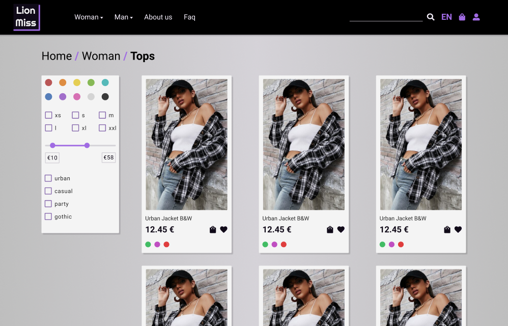

  

[💃 Personal Page](https://www.kodeneko.com) | [👗 Lion Miss Hub](https://kodeneko.com/lionmiss) | [🐱 Github](https://github.com/kode-neko) | [🐤 Twitter](https://twitter.com/KodenekoFront) | [✉️ Contact Mail](mailto:ladysun.freedom@gmail.com)

LionMiss is an unreal online shop about fashion 🛒 This project contains elements shared in front and back projects. Bellow there is an UML diagram to get an overall about business logic. This project may change every now and then, so you can be surprised in the next visit. Enjoy and send me recommendations through my social media and mail 😀

# Demo
- [🐱 Back | Github](https://github.com/kode-neko/lionmiss-back)
- [🌳 Back | Swagger](https://www.kodeneko.com/lionmiss/swagger)
- [❄️ Back | GraphQL](https://www.kodeneko.com/lionmiss/gql)
- [🐱 Front | Github](https://github.com/kode-neko/lionmiss-components)
- [🎨 Front | Storybook](https://github.com/kode-neko/lionmiss-components)
- [✏️ UI | Wireframe](https://www.kodeneko.com/lionmiss/wireframe)
- [📱 UI | Mockup](https://www.kodeneko.com/lionmiss/mockup)

 

